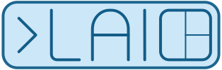

[](https://laio.sh)

Simple flexbox-inspired layout manager for tmux.

## Installation

Supported flavors are Linux and Mac (aarch64 and x86_64).

### Nix

[](https://builtwithnix.org)
```
nix profile install "github:ck3mp3r/laio-cli"
```

### Homebrew

```bash
brew tap ck3mp3r/laio-cli https://github.com/ck3mp3r/laio-cli/
brew install laio
```

### Download

Download the binary suitable for your system from the [Release Page](https://github.com/ck3mp3r/laio-cli/releases)
and place it in your `PATH`.

## Using laio

Once you have `laio` on your path simply running it will output the options available:
```
A simple flexbox-like layout manager for tmux.

Usage: laio [OPTIONS] <COMMAND>

Commands:
  start       Start new session
  stop        Stop session
  list        List active (*) and available sessions
  config      Manage Configurations
  session     Manage Sessions
  completion  Display the completion file for a given shell
  help        Print this message or the help of the given subcommand(s)

Options:
      --config-dir <CONFIG_DIR>  [default: ~/.config/laio]
  -v, --verbose...               Increase logging verbosity
  -q, --quiet...                 Decrease logging verbosity
  -h, --help                     Print help
  -V, --version                  Print version

```

### Creating a Configuration

Using laio requires a configuration that describes the kind of tmux session you want. Config files are usually stored in `~/.config/laio`.
You can also have config files inside project directories named `.laio.yaml`.

To create a new configuration run ```laio config create <name-of-config>```. This will create a new config with the same session name.
The config is a default 2 window session with the first window being dedicated for `$EDITOR` and the second window consisting of two vertically split panes.

### Starting a Session

To start a session from an existing config run ```laio start <name-of-config>```.
To start a session from within a project directory containing a `.laio.yaml` run ```laio start```.

### Configuration YAML

A simple yaml configuration looks as follows:
```yaml
---
name: myproject

path: /path/to/myproject
startup: # a list of startup commands to run
  - command: gh
    args:
      - auth
      - login

startup_script: |
  #!/usr/bin/env bash
  echo "Hello from the startup script"

shutdown: # a list of shutdown commands to run
  - command: echo
    args:
      - "Bye bye!"

shutdown_script: |
  #!/usr/bin/env bash
  echo "Bye bye from the shutdown script"

shell: /bin/zsh # optional shell for the given session to use

env: # optional environment variables to pass to the session
  FOO: bar
  BAZ: foo

windows:
  - name: code
    panes:
      - name: Editor
        commands: # starting up system editor in this pane
          - command: $EDITOR

  - name: local
    flex_direction: row # splits are vertical, panes are side by side
    panes:
      - flex: 1 # what proportion of the window to occupy in relation to the other splits
        flex_direction: column # splits are horizontal, panes are on top of each other
        panes:
          - flex: 1
            path: ./foo # path relative to the root path declared above
            style: bg=darkred,fg=default # specify pane styles as per tmux options
            commands:
              - command: colima
                args:
                  - start
                  - --kubernetes
                  - --kubernetes-version
                  - "v1.25.11+k3s1"
                  - --cpu 6
                  - --memory 24
            script: |
              #!/usr/bin/env bash
              echo "You can also have custom scripts embedded on a pane level"

          - flex: 6
            focus: true
      - flex: 1
```

### Completion

To generate the right shell completion for your shell run `laio completion <your-shell>`.

### Known Limitations

Currently there is a known limitation to the number of nested panes allowed.
Play around with the configurations to see what works best for you.
